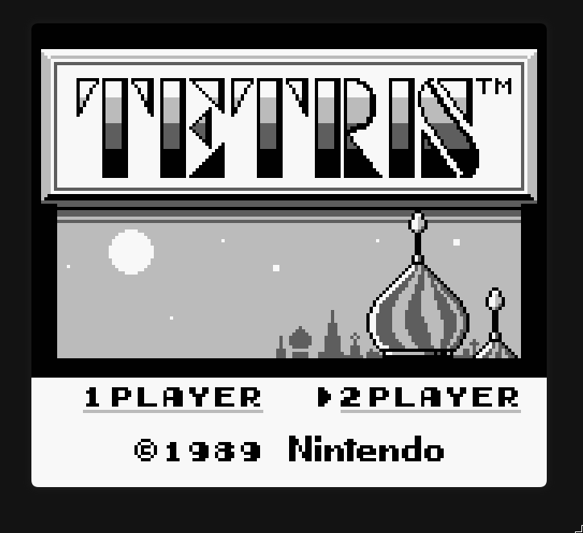

# picoboy

Game Boy emulator from scratch, targeting Raspberry Pi Pico 2 (RP2350).



## Status

| Feature | Status |
|---------|--------|
| CPU (Blargg 11/11) | ✅ |
| Background + Window | ✅ |
| Sprites (OBJ) | ✅ |
| DMA (FF46) | ✅ |
| PPU modes + timing | ✅ |
| VBlank interrupt | ✅ |
| STAT interrupt (LYC=LY) | ✅ |
| Joypad input (keyboard) | ✅ |
| Timer | ⏳ |
| Sound | ❌ |
| MBC | ❌ |
| Pico target | ⏳ |

**Tetris** boots to the title screen, accepts Start (Enter / Z), and is playable.

## Project layout

```
picoboy/
├── Makefile
├── CMakeLists.txt        # Pico firmware (RP2350)
├── src/                  # sources (.c)
├── include/              # headers (.h)
├── build/                # host objects + binaries (gbemu, gbtest)
├── build-pico/           # Pico CMake build (gitignored)
├── test-roms/            # Blargg test ROMs (git submodule)
├── docs/                 # screenshots
└── tools/                # scripts (run_blargg.sh)
```

## Build

```
make emu          # build host emulator with raylib -> build/gbemu
make run          # run Tetris (tetris.gb in repo root)
make gbtest       # build headless test harness   -> build/gbtest
make test-blargg  # run Blargg cpu_instrs suite (11 ROMs)
make pico         # build Pico firmware via CMake -> build-pico/
make flash        # flash firmware to Pico
make clean        # remove build/ and build-pico/
```

## Controls

| Game Boy | Keyboard |
|----------|----------|
| A        | Z        |
| B        | X        |
| Start    | Enter    |
| Select   | Tab      |
| D-Pad    | Arrows   |

## Testing

CPU correctness is verified with Blargg's `cpu_instrs` suite
(`test-roms/`, git submodule). Status: **11/11 PASS**.

```
git submodule update --init     # first clone only
make test-blargg                # run all 11 individual ROMs
```

## Resources

- [Pan Docs — CPU Instruction Set](https://gbdev.io/pandocs/CPU_Instruction_Set.html)
- [gbz80(7) — instruction reference](https://rgbds.gbdev.io/docs/gbz80.7)
- [Optables — opcode cheat sheet](https://gbdev.io/gb-opcodes/optables)
- [Pan Docs (home)](https://gbdev.io/pandocs/)
- [Blargg test ROMs](https://github.com/retrio/gb-test-roms)
